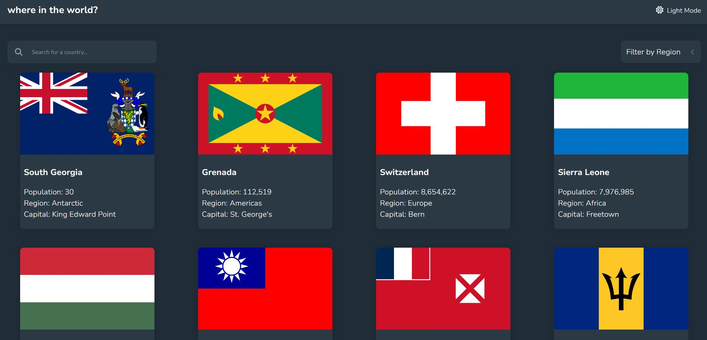

# Frontend Mentor - REST Countries API with color theme switcher solution

This is a solution to the [REST Countries API with color theme switcher challenge on Frontend Mentor](https://www.frontendmentor.io/challenges/rest-countries-api-with-color-theme-switcher-5cacc469fec04111f7b848ca). Frontend Mentor challenges help you improve your coding skills by building realistic projects. 

## Table of contents

- [Overview](#overview)
  - [The challenge](#the-challenge)
  - [Screenshot](#screenshot)
  - [Links](#links)
- [My process](#my-process)
  - [Built with](#built-with)
- [License](#license)
- [Author](#author)

## Overview

### The challenge 🎯 

Users should be able to:

- See all countries from the API on the homepage
- Search for a country using an `input` field
- Filter countries by region
- Click on a country to see more detailed information on a separate page
- Click through to the border countries on the detail page
- Toggle the color scheme between light and dark mode *(optional)*

### Screenshot

### Links

- Solution URL: [frontendmentor-REST-Countries](https://www.frontendmentor.io/solutions/rest-countries-8NII2qmHfe)
- Live Site URL: [REST-Countries](https://hadi-sanei.github.io/Rest-countries)

## My process

### Built with

- 
- 
- 
- 
- 

## License

Distributed under the MIT License. See `LICENSE` for more information.

## Author

- Github - [Hadi Sanei](https://github.com/hadi-sanei)
- Frontend Mentor - [@hadi-sanei](https://www.frontendmentor.io/profile/hadi-sanei)

(<a href="#REST-Countries-app">back to top</a>)
